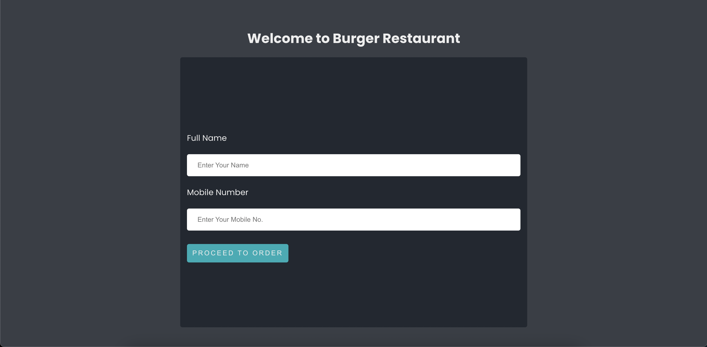

<div align="center">
  <h1>Burger Restaurant (React)</h1>
  <p>React Beautiful DND</p>

Live Site Link: [https://burger-restaurant-manush-tech.netlify.app/](https://burger-restaurant-manush-tech.netlify.app/)
</div>
<br />

### Screenshots

<div align="center"> 
<p>Header</p>



</div>


<!-- TechStack -->
### Tech Stack

  <ul>
    <li>HTML5</li>
    <li>CSS3</li>
    <li>React</li>
  </ul>

<!-- Libraries -->
### Libraries

  <ul>
    <li>react-beautiful-dnd</li>
    <li>eslint</li>
  </ul>


<!-- Getting Started -->
## Getting Started

<!-- Prerequisites -->
### Prerequisites

This project uses Yarn as package manager. So please install yarn globally to run the app


<!-- Run Locally -->
### Run Locally

Clone the project

```bash
gh repo clone Prince-Baust/burger-restaurant-manush-tech
```

Go to the project directory

```bash
  cd burger-restaurant-manush-tech
```

Install dependencies

```bash
  yarn add
```

Start the server
```bash
  yarn run start:dev
```

<!-- Information -->
## Important Information
* React Beautiful DND library is used for implementing Drag n Drop
* <React.StrictMode> shows warning and React Beautiful DND doesn't behave appropriately in development mode. But it works fine in production. So we commented out <React.StrictMode>

<!-- Contact -->
## Contact

MD. Maruf Al Hossain Prince <br />
[LinkedIn Profile](https://www.linkedin.com/in/maruf-prince) <br /> write2maruf@icloud.com
